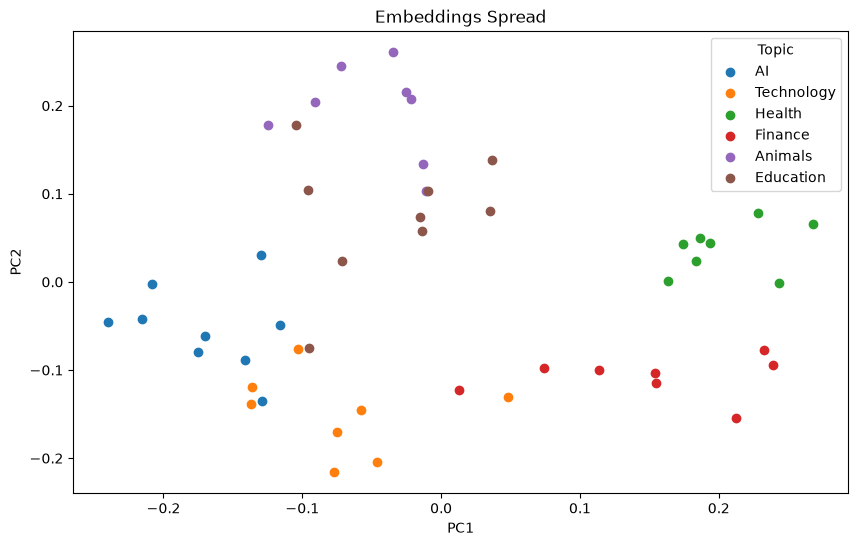

# Semantic Search with Gemini Embeddings — Flow of Work

### 1. Chunking

Paragraph → **split** on `.` → 50 sentence chunks

---

### 2. Embedding

* Each of the 50 chunks → **Gemini `gemini-embedding-001`** model → 1 vector per chunk
* Stack the 50 vectors into a numpy matrix of shape `(50, dimension)`

---

### 3. Retrieval

* Query → **Gemini embedding** model → query vector
* Compare the query vector against every row of the matrix via **cosine similarity**
* Keep track of each score alongside its original index so the matching sentence can be recovered later — the loop is what preserves that index → sentence mapping

---

### 4. Top-K

* Sort the `(index, score)` pairs by score, descending
* Use the index from each sorted pair to look up the original sentence in the chunk list

---

### 5. PCA

* Reduce dimensionality with `sklearn.decomposition.PCA(n_components=2)`
* The `(50, dimension)` matrix becomes `(50, 2)` for plotting

---

### 6. Scatter Plot

* Plot PCA column 0 on the x-axis, column 1 on the y-axis
* Color/label points by topic for a clearer visual separation

---

## Plot Result

* Sentences sharing a label (topic) cluster close together
* Sentences from different topics land far apart
* Topics that are conceptually related sit nearer each other than unrelated ones
* This shows the embeddings encode semantic meaning, not just surface wording — the model places chunks in vector space so that similar topics are geometrically closer
* A new query embeds into the region of its nearest topic
* The sentence closest to the query gets the highest cosine similarity score, which is what the top-K retrieval step relies on
